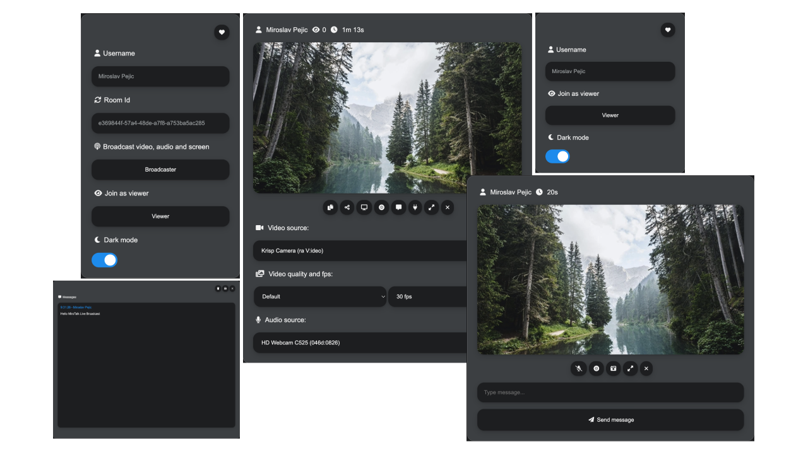

Here’s a professional README file for your **Broadcast System** project. This document is structured to provide clear information about the project, its usage, and its features.

---

# Broadcast System



## Overview

**BRO Live Broadcast** enables seamless live broadcasting of video, audio, and screen streams to all connected users (viewers). The system supports unlimited rooms, each allowing a broadcaster and many viewers, without time limitations. Users can also interact by sending messages to the broadcaster.

---

## Features

- **Live Broadcasting**: Stream audio, video, or screen in real-time.
- **Interactive Messaging**: Viewers can send messages to the broadcaster during the broadcast.
- **Unlimited Rooms**: Create multiple broadcasting rooms without time constraints.
- **Cross-Platform Support**: Accessible from various devices with a web browser.
  
---

## Quick Start

To get started with the BRO Live Broadcast application, you can run it using Node.js or Docker.

### Prerequisites

- [Node.js](https://nodejs.org/en/download) (for local installation)
- [Docker](https://docs.docker.com/engine/install/) and [Docker Compose](https://docs.docker.com/compose/) (for containerized deployment)

### Running with Node.js

1. **Clone the Repository**:

   ```bash
   git clone https://github.com/yourusername/broadcast-system.git
   cd broadcast-system
   ```

2. **Setup Environment**:

   ```bash
   # Copy .env.template to .env and edit it if needed
   cp .env.template .env
   ```

3. **Install Dependencies**:

   ```bash
   npm install
   ```

4. **Start the Application**:

   ```bash
   npm start
   ```

### Running with Docker

1. **Clone the Repository**:

   ```bash
   git clone https://github.com/SushilkumarDev/broadcast-system.git
   cd broadcast-system
   ```

2. **Setup Environment**:

   ```bash
   # Copy .env.template to .env and edit it if needed
   cp .env.template .env
   # Copy docker-compose.template.yml to docker-compose.yml and edit it if needed
   cp docker-compose.template.yml docker-compose.yml
   ```
3. **Run the Application**:

   ```bash
   docker-compose up -d
   ```

### Accessing the Application

Once the server is running, you can access the application at:

- **Home**: [http://localhost:3016](http://localhost:3016)
- **Broadcaster**: [http://localhost:3016/broadcast?id=123&name=Broadcaster](http://localhost:3016/broadcast?id=123&name=Broadcaster)
- **Viewer**: [http://localhost:3016/viewer?id=123&name=Viewer](http://localhost:3016/viewer?id=123&name=Viewer)

The broadcaster can stream audio, video, or screen to all connected viewers and receive messages from them, while viewers can interact with the broadcaster.

---

## Direct Joining

You can directly join a room as a **Broadcaster** or **Viewer** by specifying the room ID and your name.

| As            | URL                                                     |
| ------------- | ------------------------------------------------------- |
| `Broadcaster` | [http://localhost:3016/broadcast?id=123&name=Broadcaster](http://localhost:3016/broadcast?id=123&name=Broadcaster) |
| `Viewer`      | [http://localhost:3016/viewer?id=123&name=Viewer](http://localhost:3016/viewer?id=123&name=Viewer)         |

### URL Parameters

| Params | Type   | Description |
| ------ | ------ | ----------- |
| id     | string | Room ID     |
| name   | string | User name   |

---

## Embedding in an Application

To embed the MiroTalk Live Broadcast into your service or app using an iframe, use the following code snippet:

```html
<iframe
    allow="camera; microphone; display-capture; fullscreen; clipboard-read; clipboard-write; web-share; autoplay"
    src="https://bro.mirotalk.com"
    style="height: 100vh; width: 100vw; border: 0px;"
></iframe>
```

---

## License

This project is licensed under the MIT License. See the [LICENSE](LICENSE) file for more details.

---

## Contributing

Contributions are welcome! If you would like to contribute, please follow these steps:

1. Fork the repository.
2. Create a feature branch (`git checkout -b feature/AmazingFeature`).
3. Commit your changes (`git commit -m 'Add some AmazingFeature'`).
4. Push to the branch (`git push origin feature/AmazingFeature`).
5. Open a pull request.

---

## Support

If you find this project useful, consider supporting its development by buying me a coffee!

[Buy Me A Coffee](https://ko-fi.com/sushilkumar)

---

## Contact

For any inquiries or feedback, please contact me at [sushilkumardeveloper@gmail.com](mailto:sushilkumardeveloper@gmail.com).

---

Feel free to customize sections as needed, especially the repository URL, and add any additional information that you think might be helpful!
